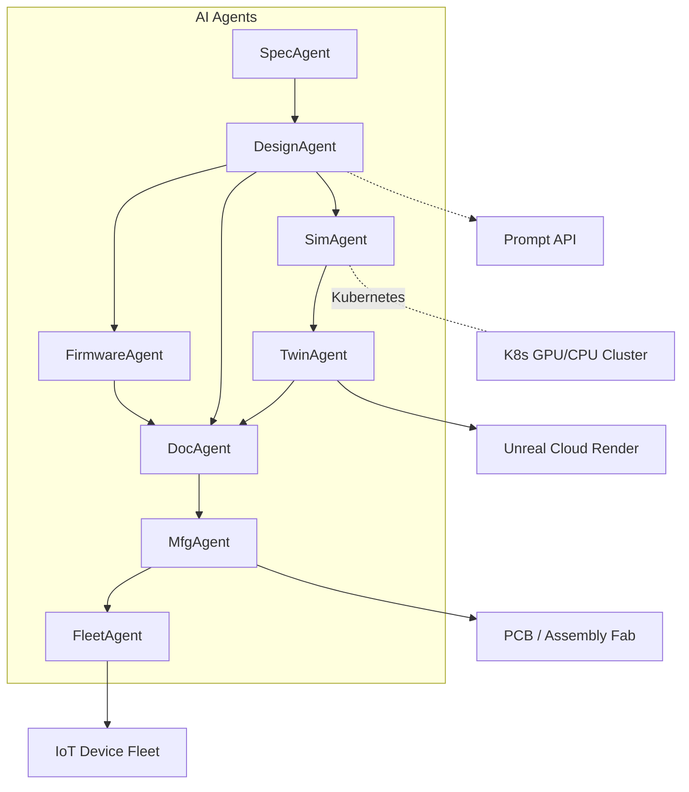

## What is OpenQQuantify?

OpenQQuantify is an open‑source, AI‑powered Electronic Design Automation (EDA) & simulation platform that lets you design, prototype, and validate electronics faster than ever. By uniting Generative AI, machine learning, autonomous multi‑agent orchestration, and a cloud‑native, game‑engine digital‑twin, we accelerate every phase of the hardware lifecycle — from napkin concept ⇢ mass‑production.

Prompt‑Driven Engineering: Instead of clicking through dozens of disjointed CAD tools, simply describe the device you want in plain English (or Python) and let our AI agents generate schematics, firmware, documentation, and a photorealistic digital twin that you can play‑test inside a AAA‑grade game engine.

# Unlock Tech Growth in 2025: Book Your FREE R&D + Digital Biz Dev"
- Fast‑track your product roadmap and digital strategy with OpenQ Quantify—our consultants guarantee 100 % satisfaction, or you don’t pay.
- We handle consulting, startups, technology, product-development, and business for you!
Take a look at our book a meeting links and sales sheet below in "Why You Should Care?" & "Why OpenQQuantify?".
- Partner with us, let's do business & grow together.

---

## Why You Should Care

| 💡 Need | 🛠️ What We Do | ⚡ Result |
| --- | --- | --- |
| **Rapid Tech R&D** | Prototypes → MVP in weeks | Faster time‑to‑market |
| **Digital Business Development** | Go‑to‑market playbooks | Revenue‑ready launches |
| **AI / ML Integration** | Custom models, not copy‑paste APIs | Competitive edge |
| **Data Strategy** | Strategy + governance | Lower burn, smarter scale |

# **Ready to level‑up?** → [**Book your strategy call**](https://calendly.com/openqquantifyexecutivemeeting/businessdevelopment) (slots fill fast!)  

---

## Why OpenQQuantify?

1. **End‑to‑End R&D** — Hardware, firmware, cloud, Web3: we’ve built it.  
2. **Growth Mindset** — Every sprint maps to a business metric, not vanity code.  
3. **Startup‑Friendly** — Flexible retainers and *Digital Growth Packages*
# Peek [Here](https://docs.google.com/document/d/1inM7T9QLtiN0kkZ7plKLJLv_ORU_WDK-xdmW65Tr298/edit?usp=sharing) 
5. **100 % Satisfaction Guarantee** — You get value or you don’t pay. Period.  

---

## Services Snapshot

### 🔬 Technology R&D
- Feasibility studies & PoCs  
- Architecture audits  
- Security & compliance reviews  

### 📈 Digital Business Development
- Market validation & user interviews  
- Monetization strategy (SaaS, usage‑based, tokenomics)  
- Growth‑loop design (SEO, community, referral)

### 🤖 AI & Data Science
- Custom LLM fine‑tuning  
- Predictive analytics dashboards  

### 🧑‍💼 **Data Strategy** 
- Engineering culture workshops  

---

## Proven Results - Case Study Quick Hits

* **FinTech MVP**: Built PCI‑compliant platform in 10 weeks → Seed round closed at $3 M.  
* **IoT Startup**: Cut firmware OTA cost by 42 % using edge AI compression.  
* **E‑commerce**: Grew organic traffic 120 % in 6 months with structured data & Core Web Vitals fixes.

*(Need refs? Ping us during your intro call—NDA‑safe decks provided.)*

---

## Special Offers 🎁

1. **FREE 30‑Minute Audit** — Codebase or growth funnel (your pick).  
2. **Launch Pad Package** — MVP build + GTM roadmap at 15 % off *(limited to 3 startups/month)*.  
3. **AI Jumpstart** — 2‑week sprint to embed generative AI in your workflow.

---

## Next Steps (Super Simple)

# 1. **Grab a time slot** on our Calendly → [Book now](https://calendly.com/openqquantifyexecutivemeeting/businessdevelopment).  
# 2. **Tell us your top challenge** (we’ll send a short pre‑call form).  
# 3. **Meet our team** on Zoom. Walk away with a game plan—no strings attached.

> **👇 Don’t wait—digital markets move fast.  
> Lock your consultation today!**

---

### About OpenQ Quantify

We’re a boutique tech consulting shop turning ideas into shipping products for startups and scale‑ups worldwide. 
# Peek at our work → **[openqquantify.com](http://www.openqquantify.com)**

---

**#R&DConsulting #DigitalBusinessDevelopment #TechStrategy #StartupGrowth #AIIntegration #ProductDevelopment**

*100 % satisfaction guaranteed—let’s build something amazing, together.* 🚀

# The OpenQQuantify Platform & Gitub Repository

## End‑to‑End Development Pipeline

Below is the typical journey from idea → shipping hardware on OpenQQuantify. Each stage is handled (or co‑piloted) by a specialised AI agent that speaks our internal Agent Protocol v3.

| Stage | AI Agent | Key Outputs | Underlying Tech |
| --- | --- | --- | --- |
| 1. Prompt Intake & Spec Synthesis | SpecAgent | Functional spec (markdown + JSON schema) | LLM (OQ‑GPT‑13B) |
| 2. Generative Schematic & PCB | DesignAgent | KiCad / Altium project, 2‑D & 3‑D renders | Graph transformers, Constraint solving |
| 3. Firmware & Driver Generation | FirmwareAgent | C/C++ or Rust codebase, unit tests, CMSIS packs | Code‑gen models, HAL knowledge base |
| 4. Simulation & Verification | SimAgent | Mixed‑signal waveforms, power/thermal plots | SPICE × ML surrogate, Monte Carlo on K8s |
| 5. Digital‑Twin Real‑World Emulation | TwinAgent | Unreal / Unity scene with physics hooks | gRPC bridge, NVIDIA PhysX, Azure Remote Render |
| 6. Iterative Optimisation | OptAgent | Pareto‑optimal BOM & topology suggestions | Reinforcement learning, Bayesian search |
| 7. Documentation & Compliance | DocAgent | PDF manual, datasheets, CE/FCC test plan | LLM + templater, LaTeX engine |
| 8. Manufacturing Handoff | MfgAgent | Gerbers, pick‑&‑place CSV, assembly drawing | IPC‑2581, JLC & MacroFab APIs |
| 9. Post‑Launch Telemetry | FleetAgent | OTA updates, anomaly detection dashboards | MQTT, TimescaleDB, Tiny ML |

All agents are fully autonomous but observe human‑in‑the‑loop guardrails — you approve every gating milestone via pull‑request‑style reviews.

## Digital Twin Powered by AAA Game Engines

Photorealistic Physics: We compile your board's STEP + BOM into a real‑time rigid‑body + thermal model inside Unreal Engine 5 (fallback to Unity HDRP).

Sensor & Actuator Emulation: The game engine hosts plug‑in stubs for IMUs, cameras, GNSS, LiDAR, displays, motors, and RF modules so you can script integration tests before touching real silicon.

Interactive Play‑Test: Hot‑reload firmware and watch the twin respond instantly; perfect for robotics, wearables, and automotive HMIs.

Cloud or Local: Spin up GPU instances on AWS NVIDIA L4 or run headless in a CI container for regression.

Think "Kerbal Space Program for hardware engineering," but deterministic and hooked to your Git commits.

## Quick Start (5 Minutes)

```
# 1 Install CLI
curl -sSL https://get.openqquantify.com | bash

# 2 Bootstrap a project (Raspberry Pi + IMU + OLED display)
oq init "portable air‑quality sensor, battery‑powered, OLED UI, logs to SD card"

# 3 Let the AI run the pipeline 🪄
cd portable-air-quality-sensor
oq run all --cloud

# 4 Open the digital twin in your browser
oq twin launch --url
```

Agent progress is streamed to your terminal as a live tree view; artifacts land in `./build/`.

## Platform Components



## Installation Options

1‑Click Cloud Sandbox: Login at https://www.openqquantify.com (free tier ≤ 6 hours build time).

Docker Compose (local): `docker compose up` — spins controller + agents + web UI.

From Source: Clone, run `make install`, then `make dev` (requires Python ≥3.10, Node ≥20, Docker).

Tip: GPU is optional; CPU‑only mode uses quantised models.

## Example Prompt‑to‑Product Walkthrough

User prompt ↴
"Design a handheld thermal camera using ESP32‑S3, 2.4‑inch LCD, AMG8833 thermal sensor,
USB‑C charging, plastic enclosure, and optional Wi‑Fi streaming."

SpecAgent extracts power budget, UI constraints, thermal profiles.

DesignAgent outputs KiCad project + 3‑D step files.

FirmwareAgent writes ESP‑IDF code with FreeRTOS tasks for sensor, UI, and OTA.

SimAgent validates power‑on surge and thermal spread at 45 °C ambient.

TwinAgent spawns an Unreal scene; you rotate the camera using WSAD and verify frame rate.

Iterate by commenting: "add physical joystick, keep BOM < $60" — agents refactor.

Approve pull request; MfgAgent uploads to PCBWay; first article arrives in ~6 days.

## Supported Dev Boards & Sensors

MCUs: STM32, ESP32, Raspberry Pi Pico, Nordic nRF52, TI CC13xx/26xx

SoCs: Raspberry Pi CM4, NXP i.MX8, AMD Kraken AI Edge

Sensors: Bosch BME‑series, TI AFE, Analog Devices IMUs, AMS optical, VL53LXX ToF

Comms: Wi‑Fi, BLE, LoRa, CAN, MQTT, UWB

Don't see your part? Add it via the Part‑Library SDK (`oq part add`)

## Autonomy & Safety

| Layer | Mechanism |
| --- | --- |
| Guardrails | JSON Schemas + GitHub PR review gates |
| Policy Enforcement | SPDX license scanner, banned‑IP blocks |
| Simulation Fuzzing | Randomised IO patterns to detect unsafe states |
| Fallback ChatOps | `/override` slash‑commands to pause or nudge agents |

All LLM calls funnel through a moderation filter; no proprietary or export‑controlled data leaves your VPC.

## Roadmap (excerpt)

[Track full roadmap & vote on features → Discussions ▶ Roadmap.](https://github.com/openqquantify/openqquantify/discussions/categories/roadmap)

## Contributing

Contributions are welcome and appreciated! Please read `CONTRIBUTING.md` and join our weekly community call (Tues 17:00 UTC+2).

## Community & Support

- Platform: https://www.openqquantify.com
- Email: connect@openqquantify.com

Need our team's help? Book an executive meeting with us here: https://calendly.com/openqquantifyexecutivemeeting/businessdevelopment.

## License

Distributed under the MIT License — see `LICENSE`.

## Sponsors & Partners

Backed by Microsoft, Google, AWS, NVIDIA, and the Linux Foundation (>$100 k cloud credits). Trusted by Tomorrow's AI, Moment Factory, REW, Mazda, and hundreds of indie makers.

⭐️ Your future is now — let's innovate together!

If OpenQQuantify accelerates your hardware journey, star ⭐ this repo and spread the word! Together we'll reshape electronics design.
